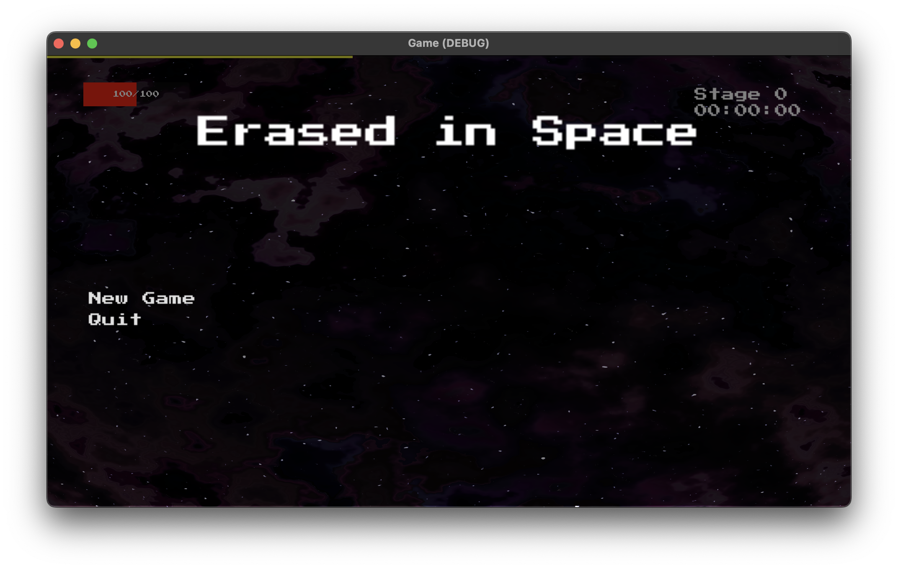

## Erased in Space

This is a simple roguelike game I made to mess around with Godot. All of the logic is written in GDScript

It's not very fun, but you can win, lose, get powerups, and get a high score

Notable features:
 * The ship is drawn analytically in a pixel shader
 * The background effect and stars are done by sampling noise in a pixel shader

 